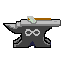
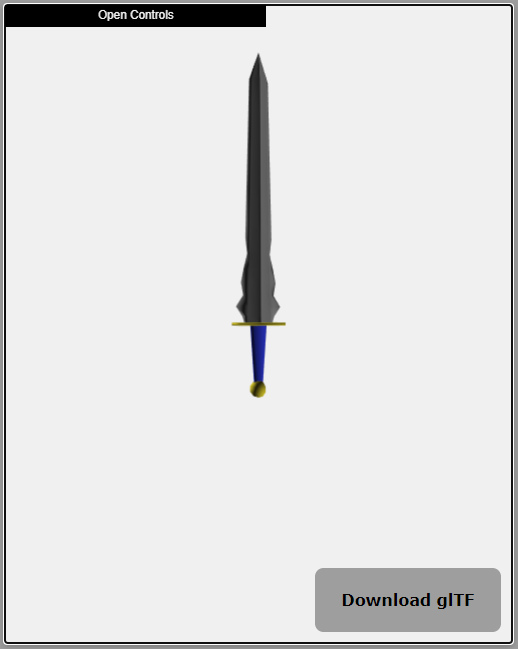

#  Infiniforge 2.0

InfiniForge is a NodeJS REST API that returns JSON
representations of procedurally generated 3D fanstasy swords.



## Whats New

Infiniforge 2.0 features a revamped generation process that
is much easier to maintain, and has the ability to produce
a wider array of weapons.

## How to Build and Run Locally

1. ```$ git clone https://github.com/ShiJbey/Infiniforge```
2. ```$ cd Infiniforge```
3. ```$ npm install```
4. ```$ npm run build```
5. ```$ npm start```
6. Open your web browser and go to ```localhost:8080``` to open the help page
which lists common routes

## How to Build and Run on Docker

1. ```$ sudo docker build -t infiniforge .```
2. ```$ sudo docker run -d -p 8080:8080 infiniforge```
3. Open your web browser and go to localhost:8080

## Building the Documentation

The documentation is generated using [Typedoc](https://typedoc.org)
 ```$ npm run typedoc``

## Config Files

infiniforge-config.json can be changed to specify a different port and allow for verbose output.

## Example

```javascript

const Infiniforge = require('infiniforge');

const swordGenerator = Infiniforge.SwordGenerator();

swordGenerator.generate({

    "output": "gltf",
    "style": "long"

}).then((sword) => {

        console.log(sword);

}).catch(console.error);

```

## How are models exported

When accessing the server via the rest API, geometry is exported using the
glTF 2.0 (GL Transmisssion Format ) by Khronos Group. It is a royalty-free
specification for the efficient transmission and loading of 3D scenes and
models by applications. The spec is available [here](https://www.khronos.org/gltf/ "glTF Overview").
What is returned by the API is *.glTF JSON. This
application uses the GLTF exporter provided with [ThreeJS](https://threejs.org/docs/#examples/exporters/GLTFExporter).

## What can I do with this

Output can be saved as a *.gltf file and used in a multitude of projects. Various importers are
available from [Khronos Group](https://www.khronos.org/gltf/). For example, one could use this
in a unity game by taking advantage of the [UnityGLTF plugin](https://github.com/KhronosGroup/UnityGLTF). glTF files can also be opened on windows 10 using the 3D Viewer application.

## Credits

Sword morphologies sourced from: [Long Sword Wikipedia](https://en.wikipedia.org/wiki/Longsword)

## Misc

This project was originally made as part of the August 2016 Reddit procedural generation challenge
Found here: [Reddit Challenge](https://www.reddit.com/r/proceduralgeneration/comments/4wubjy/monthly_challenge_9_august_2016_procedural_weapons/)
