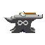
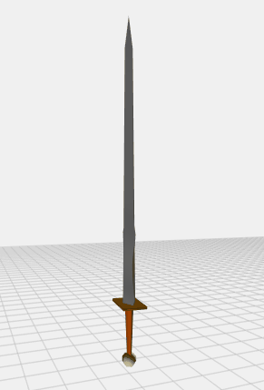

#  Infiniforge 2.0

Typescript/Javascript library for procedurally generating 3D fantasy swords.

This project was originally made as part of the August 2016 Reddit procedural generation challenge
Found here: [Reddit Challenge](https://www.reddit.com/r/proceduralgeneration/comments/4wubjy/monthly_challenge_9_august_2016_procedural_weapons/)

## CMPM202 - Project 1

I implemented a version of the [Wave Function Collapse algorithm](https://github.com/mxgmn/WaveFunctionCollapse) adapted for generating a list of curves used during blade generation. Getting a good output from the algorithm involves tweaking the weights of edge cure types as well as the various parameters offered by the base Infiniforge API.

Group Members: Shi Johnson-Bey

Sample output (below).



Constraints:

```Typescript
const TILES: BladeTile[] = [
  {
    name: 'edge/flat',
    weight: 1,
    rules: {
      left: ['edge/flat', 'edge/flat-neg', 'edge/flat-pos', 'edge/sin'],
      right: ['edge/flat', 'edge/flat-neg', 'edge/flat-pos', 'edge/sin'],
    },
  },
  {
    name: 'edge/flat-pos',
    weight: 2,
    rules: {
      left: ['edge/flat', 'edge/flat-neg', 'edge/sin'],
      right: ['edge/flat', 'edge/flat-neg', 'edge/sin'],
    },
  },
  {
    name: 'edge/flat-neg',
    weight: 2,
    rules: {
      left: ['edge/flat', 'edge/flat-pos', 'edge/sin'],
      right: ['edge/flat', 'edge/flat-pos', 'edge/sin'],
    },
  },
  {
    name: 'edge/sin',
    weight: 3,
    rules: {
      left: ['edge/flat', 'edge/flat-pos', 'edge/flat-neg', 'edge/flat-neg'],
      right: ['edge/flat', 'edge/flat-pos', 'edge/flat-neg', 'edge/flat-neg'],
    },
  },
];
```

## Running the code

This is an experimental version of infiniforge and is not available to instal via NPM. If you would like to run this code, use the instructions provided below.

1. `$ git clone https://github.com/ShiJbey/Infiniforge`
2. `$ cd Infiniforge`
3. `$ npm install`
4. `$ npm run build:all`
5. `$ npm start`
6. Open your web browser and go to `localhost:8080`

## Building the Documentation

The documentation is generated using [Typedoc](https://typedoc.org):

`$ npm run typedoc`

## Example Usage

```javascript
// Generate random sword and write it to a file
const fs = require('fs');
const infiniforge = require('infiniforge');

const swordGenerator = new infiniforge.SwordGenerator();

swordGenerator
  .generate({
    output: 'gltf',
    style: 'long',
  })
  .then((sword) => {
    try {
      fs.writeFileSync('sword.gltf', JSON.stringify(sword));
    } catch (err) {
      console.error(err);
    }
  })
  .catch(console.error);
```

## How are models exported

The server exports 3D meshes as JSON in the
glTF 2.0 (GL Transmission Format ) by Khronos Group. It is a royalty-free
specification for the efficient transmission and loading of 3D scenes and
models by applications. The spec is available [here](https://www.khronos.org/gltf/ 'glTF Overview').
This application uses a modified version of the GLTFExporter provided
with [ThreeJS](https://threejs.org/docs/#examples/exporters/GLTFExporter).

## What can I do with this

Infiniforge output can be saved as a \*.gltf file and used in a multitude of projects. Various importers are
available from [Khronos Group](https://www.khronos.org/gltf/). For example, one could use this
in a unity game by taking advantage of the [UnityGLTF plugin](https://github.com/KhronosGroup/UnityGLTF). Also, glTF files can also be opened on windows 10 using the 3D Viewer application.

## References

- https://en.wikipedia.org/wiki/Longsword

- http://www.lordsandladies.org/middle-ages-weapons.htm

- https://www.medievalswordsworld.com/

- https://github.com/mxgmn/WaveFunctionCollapse
